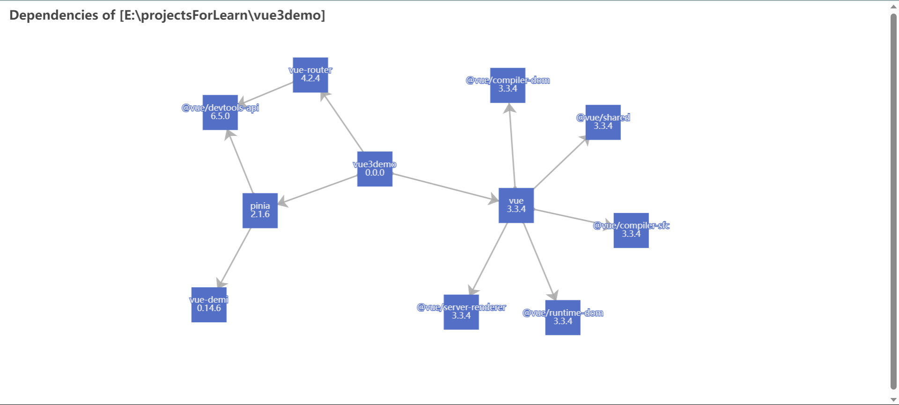

# pkg-viz-cli

It's a tool for analyzing and visualizing the dependency relationships of NPM packages, like this:



## Install

`pkg-viz-cli` is a CLI NPM package, however, I don't think it's good enough to be published, so you have to clone this repository and compile it at first.

```bash
# download
git clone https://github.com/dan-kuroto/pkg-viz-cli.git
cd pkg-viz-cli
# compile
npm install
npm run compile
# install
npm install -g .
```

## Usage

Just `cd` into a npm package and call `pkg-viz-cli`.
| options | parameter | type | default | description |
|:-:|:-:|:-:|:-:|:-:|
| `-d` / `--depth` | `<depth>` | number | 2 | recursion depth ("Infinity" is valid) |
| `--dev` | - | boolean | false | show devDependencies |
| `--json` | `<file-path>` | string | - | output file path (export JSON files instead of generating chart) |
| `--indent` | `<indent>` | number | 2 | JSON indent |

## License

`pkg-viz-cli` is under the MIT license. However, for chart rendering, we have utilized `echarts.js`. Although we have directly included the source code of `echarts.min.js` in this repository, the source code from `echarts` still adheres to its original license.
